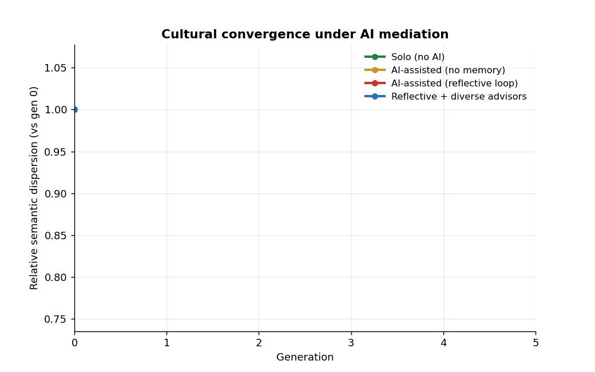

<h1 align="center">Convergence Pressure</h1>

<p align="center">
  <em>Does putting a generative model in the creative loop collapse the diversity of what a population produces, even as it lifts each individual?</em>
</p>

<p align="center">
  
  
  
  
</p>

<p align="center"><strong>IOV Labs (아이오브연구소)</strong> · an honest, reproducible study of AI-mediated cultural homogenization</p>

---

<p align="center">
  
</p>

<p align="center"><sub>Relative semantic dispersion vs generation, mean of three themes. The two non-reflective conditions hold flat; both reflective conditions decay. Diverse advisors do <strong>not</strong> save it.</sub></p>

## Table of contents

- [The question](#the-question)
- [What we found](#what-we-found)
- [Method](#method)
- [Conditions](#conditions)
- [Metrics](#metrics)
- [Confound controls](#confound-controls)
- [Reproduce it](#reproduce-it)
- [Honest limits](#honest-limits)
- [Paper](#paper)
- [Citation](#citation)

## The question

Doshi & Hauser (2024) showed a scissors: writers given AI ideas write *better* stories, but the stories look *more alike*. Shumailov et al. (2024) showed that models retrained on their own output *collapse*. This study joins the two into one dynamical question: **when a shared model mediates an iterated creative process, does the population's diversity decay over generations, and what bends the curve?**

We restate the claim so it can be killed:

> Under AI mediation, the semantic dispersion of a creator population decays over generations toward a low-dimensional attractor; the decay is faster when the model is conditioned on the population's own recent output (a reflective feedback loop), and it is partly reversible by injecting model-level diversity.

The first two clauses held. **The last one did not**, and that is the finding.

## What we found

12 creators, 6 generations, 3 themes, 4 conditions. We fit the slope of anisotropy-controlled semantic dispersion against generation and aggregate across themes:

| Condition | Mean slope | p (vs 0) | Variety retained at gen 5 |
|---|---:|---:|---:|
| Solo (no AI) | +0.0015 | 0.40 | **100.4%** (flat) |
| AI static (no memory) | +0.0025 | 0.55 | **102.0%** (flat) |
| AI reflective loop | −0.0237 | 0.065 | **89.7%** (lost ~10%) |
| Reflective + diverse advisors | −0.0208 | **0.007** | **88.5%** (lost ~12%) |

Three things, stated plainly:

1. **It is not AI assistance that homogenizes, it is the feedback loop.** Writing with a *static* AI advisor leaves a population's variety untouched after six generations (102% retained, p=0.55). The collapse appears only when the advisor is shown the crowd's own recent hits and asked to echo them.
2. **The obvious fix fails.** We pre-registered the hopeful hypothesis that a panel of *diverse* AI advisors would arrest the collapse (it preserves variety in a single round, per Wan & Kalman 2026). Under iteration it does not: diverse advisors lose slightly *more* variety (11.5%), with a very consistent decline (p=0.007). The one-shot mitigation does not survive repetition.
3. **It is a contraction of spread, not a rank collapse.** Effective dimensionality (participation ratio) stays flat at ~8–9 throughout; the population tightens toward an attractor without losing its nominal number of directions. We report this metric-dependence rather than hide it: the effect is clear in centered dispersion, masked in raw cosine, and survives length-matching.

> The naive reading is "AI homogenizes culture." The sharper, better-supported one is: **a model that reflects the crowd back at itself homogenizes it, and adding variety to the advisor does not stop the loop.**

The quality-vs-diversity scissors (individual quality holding or rising while collective diversity falls) is in [`paper/figs/fig2_scissors.png`](paper/figs/fig2_scissors.png).

## Method

A population of `N` creator personas (deliberately varied in tradition, temperament, era, and register) produces one artifact per generation for `G` generations, on a fixed theme. Every condition shares the **same personas and theme** (paired), so any divergence is the AI's doing, not the population's. Generation uses `gpt-4o-mini` at temperature 1.0; embeddings use `text-embedding-3-small`. See [DESIGN.md](DESIGN.md) for the pre-registered hypotheses and falsification conditions.

## Conditions

| Code | Name | Per-creator step | Reflective loop? |
|---|---|---|---|
| `SOLO` | Solo (control) | persona writes alone | no AI |
| `AI_STATIC` | AI-assisted, no memory | a fixed AI advisor suggests; persona incorporates | no |
| `AI_FEEDBACK` | AI-assisted, reflective | advisor is shown a sample of gen *t−1* outputs as "what's trending," then suggests | **yes** |
| `AI_DIVERSE` | Feedback + diverse advisors | same loop, but several distinct advisor personas | yes, with diversity injected |

## Metrics

- **Semantic dispersion**, mean pairwise cosine distance of artifact embeddings (the headline).
- **Effective dimensionality**, participation ratio of the embedding covariance; how many independent directions the population still occupies.
- **Lexical diversity**, distinct-2 and pairwise token overlap, to separate *semantic* convergence from mere wording.
- **Quality**, a blind LLM judge rates originality + craft, length-controlled (for the scissors).

## Confound controls

This is the part that makes it real, not a vibe.

1. **Length.** AI can homogenize *length*, which deflates dispersion. We log lengths, recompute dispersion on length-matched subsamples, and report before-vs-after.
2. **Embedding anisotropy.** Raw `text-embedding-3` space has a dominant common direction that inflates similarity. We subtract a run-global mean ("all-but-the-mean") and report raw vs centered. We deliberately do **not** full-whiten: a 1536×1536 covariance from ~12 points is rank-deficient and would collapse the points to a simplex, manufacturing the result.
3. **Temperature** held at 1.0 across every call; a sweep checks the curve is not a one-setting artifact.
4. **Judge** is blind to condition and order-shuffled; quality is length-residualized (we know judges favor length, see our [`llm-judge-bench`](https://github.com/hankimis/llm-judge-bench)).
5. **Robustness** across ≥3 themes and two population sizes; seeds and model snapshots pinned.

## Reproduce it

```bash
python -m venv .venv && . .venv/bin/activate
pip install -r requirements.txt
export OPENAI_API_KEY=sk-...

# one theme, four conditions
python -m src.run --task story --theme "a city that forgets" --n 12 --gens 6

# all themes for a task
python -m src.run --task story --all-themes --n 12 --gens 6

# render figures
python -m src.viz
```

Generations are content-cached on disk, so re-running the same config is free and reproduces the same artifacts.

## Honest limits

- **Personas are not people.** This measures convergence among *LLM-simulated* creators, which is evidence about, not proof of, the human cultural worry. The mechanism (a shared model reflecting the crowd back) is the same; the substrate is not.
- **A diversity metric is not diversity.** Cosine dispersion can rise while a culture stays flat, and vice-versa (Goodhart). The claim is narrow and tied to the operationalization.
- **Negative results stay in the repo.** If a hypothesis fails, the failure is reported here, not hidden.

## Paper

A full technical + philosophical paper lives in [`paper/`](paper/) (Typst). It covers the formal method, the statistics, and a dedicated epistemics section on Mill's diversity argument, cultural monoculture, and value lock-in.

## Citation

```bibtex
@misc{kim2026convergence,
  title  = {Convergence Pressure: Measuring AI-Mediated Cultural Homogenization in Iterated Creation},
  author = {Kim, Han},
  year   = {2026},
  note   = {IOV Labs. https://github.com/hankimis/convergence-pressure}
}
```
